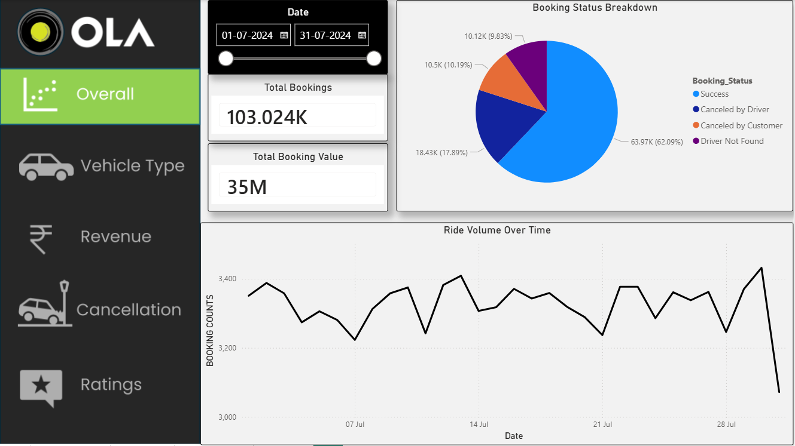
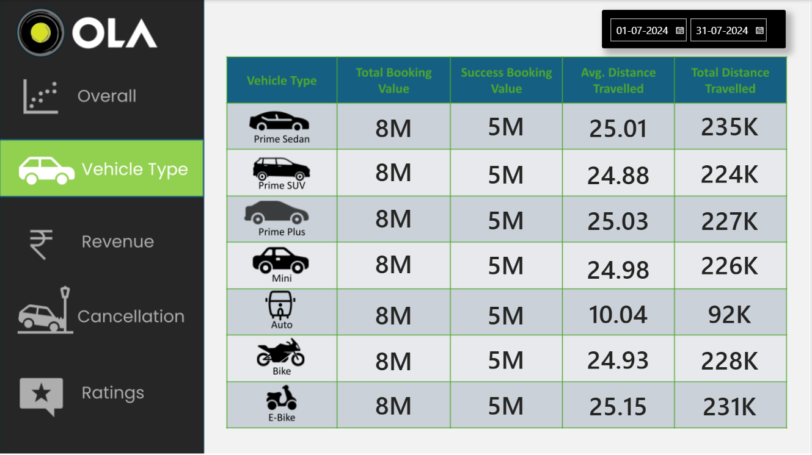
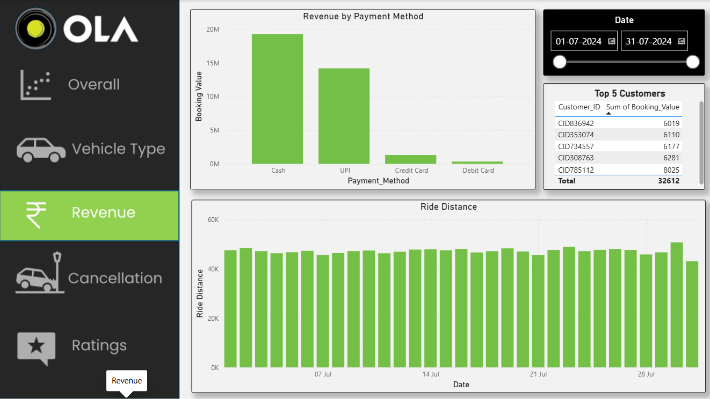
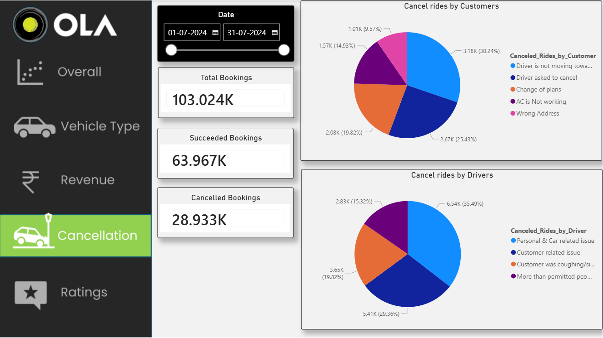
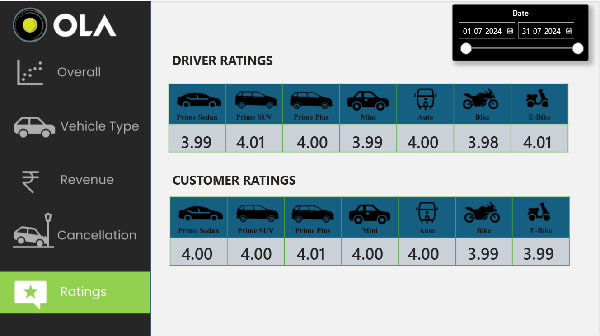

# Ola Data Analytics Project 🚖

This project is based on analyzing ride booking data similar to Ola.
The goal was to understand booking trends, cancellations, revenue, and customer behavior using SQL and Power BI.

---

## Tools Used

* SQL
* Power BI
* Excel

---

## Project Overview

The dataset contains around 1 lakh ride bookings for one month.

In this project, I analyzed:

* Booking trends over time
* Cancellation patterns (customer & driver)
* Revenue distribution
* Vehicle performance
* Customer and driver ratings

---

## Key Insights

* Around 60%+ bookings were successfully completed
* Cash and UPI were the most preferred payment methods
* Prime category vehicles generated higher revenue
* Most cancellations were due to driver-related issues
* Ratings were mostly consistent around 4.0

---

## Dashboard

### Overall Analysis

### Vehicle Type Analysis

### Revenue Analysis

### Cancellation Analysis

### Ratings Analysis

---

## What I Learned

* Writing SQL queries for business problems
* Data cleaning and handling datasets
* Building dashboards in Power BI
* Extracting insights from raw data

---

## Conclusion

This project helped me understand how companies analyze ride data to make business decisions.
